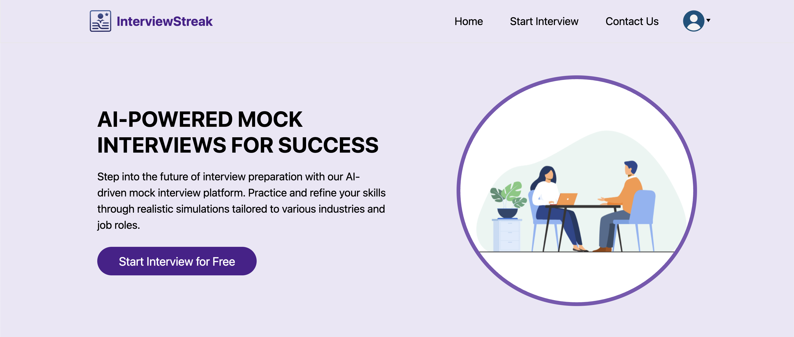
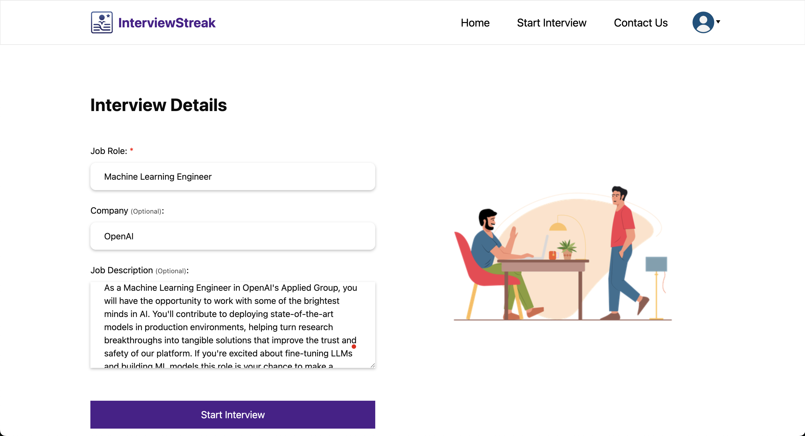
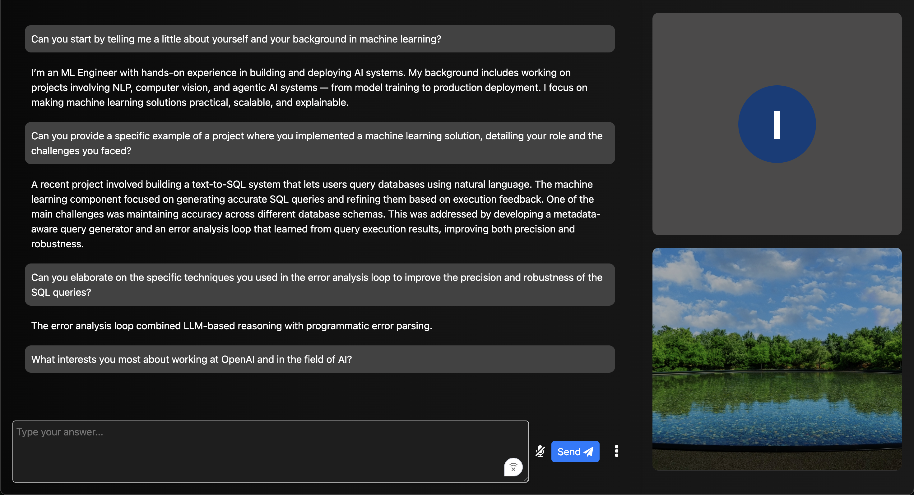
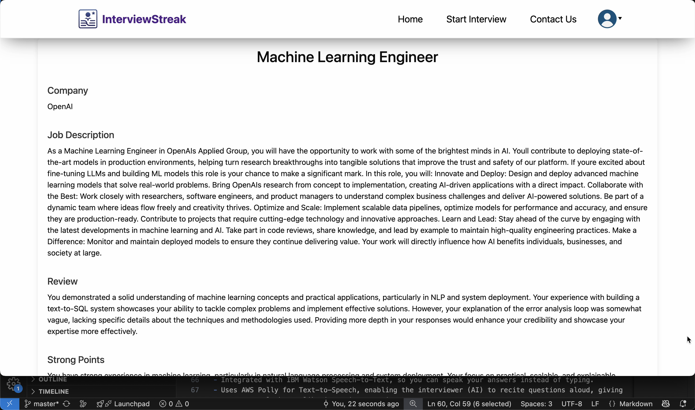

<div align="center">


# InterviewStreak

**AI-Powered Mock Interview Assistant**

[]()
[]()
[]()
[]()

</div>

---

## Overview

**InterviewStreak** is a full-stack AI interview simulation platform built with Django and powered by modern **LLMs**.  
It mimics the **real interview experience** by generating intelligent questions, **cross-questions**, and detailed performance reviews.

You can customize interviews for specific **roles**, **companies**, and **job descriptions** — then receive **answer-level analysis** with **actionable feedback**.

---

## Demo Video

Click on the image below to see the video!

[](https://github.com/shubh-tripath-i/InterviewStreak/blob/master/mysite/migpt/static/migpt/images/demo.mp4)


## Key Features

### Intelligent Interview Generation
- Automatically generates **job-relevant questions** based on your selected **job role** and optional **job description** and **company name**.  
- Uses modern LLMs to ensure relevance and depth.



### Cross-Questioning Mechanism
- Dynamically generates **follow-up questions** for your answers when needed.  
- Mimics a realistic interviewer’s curiosity, testing both **breadth and depth** of your understanding.



### Comprehensive Evaluation
After the interview, you receive a detailed performance report that includes:

- **Overall Review** – Objective assessment of your performance.  
- **Strengths and Weaknesses** – Personalized observations.  
- **Improvements Section** – Targeted tips to enhance your future answers.  
- **Selection Verdict** – AI-determined “Selected / Not Selected” decision.  
- **Reason for Rejection (if any)** – Clear and constructive reasoning.  
- **Answer-Level Review** – Individual feedback for every response, including:  
  - The question asked  
  - Your response  
  - Model’s evaluation and feedback
  - “Perfect Answer” suggestions for improvement

[](https://github.com/shubh-tripath-i/InterviewStreak/blob/master/mysite/migpt/static/migpt/images/review.mp4)


### Practice UI

- A smooth and interactive interview-like interface.
- Integrated with IBM Watson Speech-to-Text, so you can speak your answers instead of typing.
- Uses AWS Polly for Text-to-Speech, enabling the interviewer (AI) to recite questions aloud, giving a more natural, human-like interview experience.
- Both features make practice sessions immersive and closer to real-world interview dynamics.
(Requires AWS credentials for Polly integration.)

### Minimal LLM Cost

- Uses an optimized low-cost OpenAI model, ensuring that each complete interview — including follow-up questions and feedback generation — costs just a few cents.
- Designed to balance realism, performance, and affordability, making AI-powered interview practice accessible to everyone.

---

## Why InterviewStreak

Unlike static question sets or generic interview prep tools, **InterviewStreak**:
- Uses **modern AI (LLMs)** to dynamically tailor interviews.  
- Generates **role-specific and company-specific** interview experiences.  
- Provides **detailed, answer-level AI evaluation** and feedback.  
- Encourages **self-improvement through structured insights**.  
- Runs entirely **locally** — no authentication, no external database, and no user data tracking.

This makes it a perfect open-source tool for both individual learners and educators looking to integrate AI-powered mock interviews into their training programs.

---

## Prerequisite

You only need an OpenAI API Key to run this project.

## Setup Instructions

### 1. Clone the Repository
```bash
git clone https://github.com/shubh-tripath-i/InterviewStreak.git
cd interviewstreak
````

### 2. Verify Python Version

Ensure you have **Python 3.10.11** installed:

```bash
python3 --version
```

### 3. Create a Virtual Environment

**macOS / Linux:**

```bash
python3 -m venv venv
source venv/bin/activate
```

**Windows (PowerShell):**

```bash
python -m venv venv
.\venv\Scripts\activate
```

### 4. Install Requirements

```bash
pip install -r requirements.txt
```

### 5. Configure Environment Variables

All environment variables are stored in the provided **`env_sample.sh`** file.
This file includes keys required for OpenAI and optionally AWS Polly (for text-to-speech support). If AWS credentials are set, questions will be recited in natural speech to give more realistic experience.

For OpenAI API key, you can refer to https://platform.openai.com/docs/quickstart
For AWS Polly credentials, you can refer to https://docs.aws.amazon.com/IAM/latest/UserGuide/id_credentials_access-keys.html

#### macOS / Linux

1. Open the file in your editor:

   ```bash
   nano env_sample.sh
   ```
2. Fill in your credentials.
3. Save it, then load the variables into your shell:

   ```bash
   source env_sample.sh
   ```
4. Verify they are set correctly:

   ```bash
   echo $OPENAI_API_KEY
   ```

---

#### Windows (PowerShell)

1. Open PowerShell **as Administrator**.
2. Manually set environment variables using:

   ```powershell
   setx OPENAI_API_KEY "your_api_key_here"
   setx MODEL_NAME "gpt-4o-mini"
   setx AWS_SECRET_ACCESS_KEY "your_secret_key_here"
   setx AWS_ACCESS_KEY_ID "your_access_key_here"
   ```
3. Restart PowerShell or VS Code terminal for changes to take effect.
4. Confirm they are applied:

   ```powershell
   echo $env:OPENAI_API_KEY
   ```

---

> ⚠️ **Note:**
>
> * Keep your keys private and **never commit the `.sh` file** with credentials to GitHub.
> * The AWS credentials are **optional** — only needed if you want to enable **Text-to-Speech (TTS)** features via AWS Polly.
> * By default, the app will run using **OpenAI only** if Polly credentials are not provided.

### 6. Run Migrations

```bash
cd mysite
python manage.py migrate
```

### 7. Run the Server

```bash
python manage.py runserver
```

Visit: **[http://127.0.0.1:8000/](http://127.0.0.1:8000/)**

### 8. Access the Admin Panel

Django provides a powerful built-in admin interface for managing all app data, including users, interview sessions, and feedback.

Visit:

```
http://127.0.0.1:8000/admin/
```

You’ll see all your models such as:

* **Users**
* **User Profiles**
* **User Interviews**
* **Feedback**
* **Contact Us messages**

This is useful for debugging, inspecting data, or manually reviewing user performance.

---

## License

This project is released under the [MIT License](./LICENSE).

## Authors

Shubh Tripathi [Linkedin](https://www.linkedin.com/in/shubh--tripathi/)

Vikas Yadav [Linkedin](https://www.linkedin.com/in/vikas-yadav-devops/)
